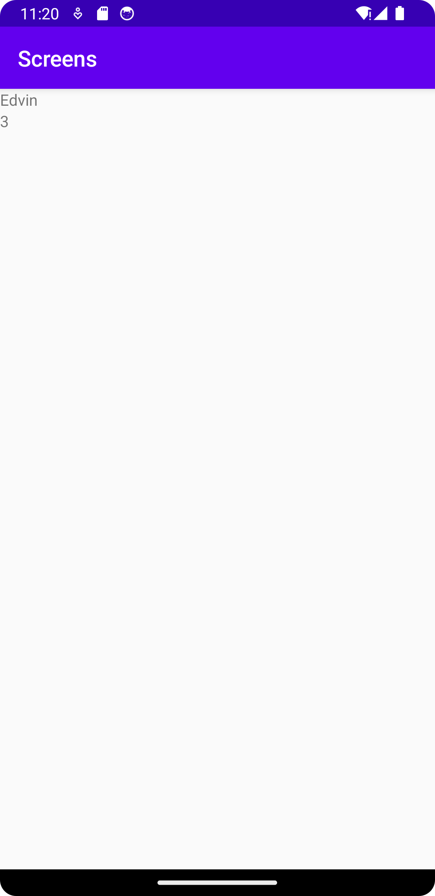
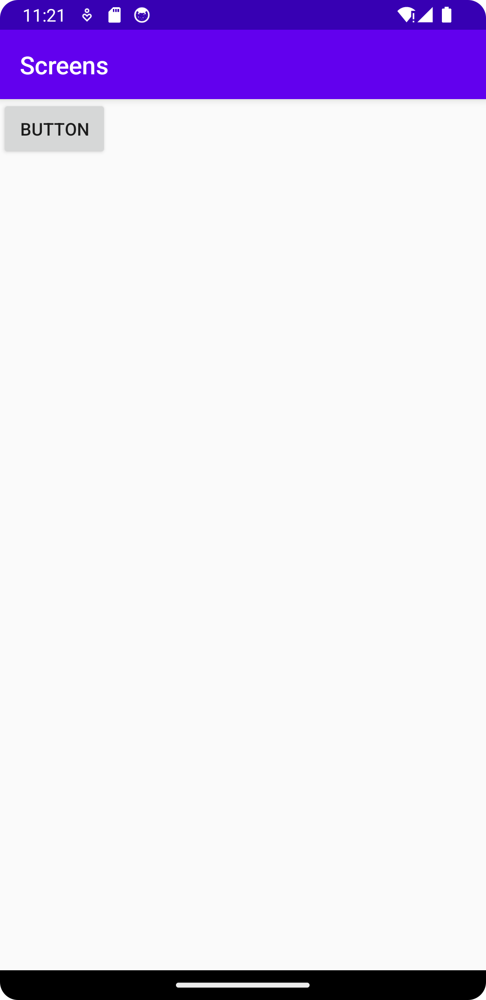

# Rapport
Det jag har gjort är att jag har skapat en ny activity och lagt till knapp i orginalactivityn som gör så att den andra 
activityn startas med datan name och number när användaren trycker på knappen. Nedan är koden för detta. (1.png)
```
super.onCreate(savedInstanceState);
        setContentView(R.layout.activity_main);
        Button b = findViewById(R.id.my_button);
        b.setOnClickListener(new View.OnClickListener() {
            @Override
            public void onClick(View view) {
                Intent intent = new Intent(MainActivity.this, ChildActivity.class);
                intent.putExtra("name", "Edvin");
                intent.putExtra("number", 3);
                startActivity(intent);
                Log.d("==>","Clicked the button");
```
I Childactivity används datan som skickades från första activityn för att fylla två gränssnittselement. (2.png)
Nedan är koden för detta
```
        name = findViewById(R.id.set_name);
        number = findViewById(R.id.set_number);

        Bundle extras = getIntent().getExtras();
        if (extras != null) {
            String name = extras.getString("name");
            int number = extras.getInt("number");
        }
        name.setText(extras.getString("name"));
        number.setText(String.valueOf(extras.getInt("number")));
```



